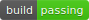
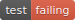
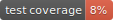
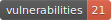

# Django-Serverside




[](https://github.com/psf/black)

This is a [Django](https://www.djangoproject.com/) app that allows you to create
database users directly from the Django admin interface. This is useful for data science
applications. For example, you can allow privileged users to make advanced SQL queries
from tools like [Matlab](www.mathworks.com), 
[Excel](https://www.microsoft.com/de-de/microsoft-365/excel), 
[Python](https://www.python.org/), [R](https://www.r-project.org/) and others.<br />
<br />
Note that creating database users from an application requires the application to have 
the privilege to create new database users. This may pose an unacceptable vulnerability 
to your database. For example, an attacker may exploit a bug in your application
with which the attacker acquires the privileges to do anything with your database. 
Therefore, you should only use this app for django projects that are isolated from the
public and operate in an environment with trusted users.  

## Prerequisites
Django-Serverside currently only works with [PostgreSQL](https://www.postgresql.org/).

## Installation
You may install Django-Serverside in your python environment using pip as follows:
```Shell
python -m pip install git+https://github.com/woernerm/django-serverside.git
```
Then, add serverside to the list of installed applications in the settings file of your
Django project like so:
```py
INSTALLED_APPS = [
    "serverside",
    "django.contrib.admin",
    ...
]
```
Finally, replace your default user model as described in the 
[Django documentation](https://docs.djangoproject.com/en/4.0/topics/auth/customizing/#substituting-a-custom-user-model)
by adding the following line to your settings file:
```py
AUTH_USER_MODEL = "serverside.User"
```

## Documentation
To view the developer documentation, clone the repository to your local machine and open 
docs/html/index.html.

## Running Tests
You may run the tests shipped with Django-Serverside yourself by editing the 
tests/settings.py file and providing your own database credentials. The default 
connection settings are:
```py
DATABASES = {
    "default": {
        "ENGINE": "django.db.backends.postgresql",
        "HOST": "localhost",
        "PASSWORD": "12345",
        "NAME": "serverside_db",
        "USER": "test_user",
        "TEST": {"NAME": "test_database"},
    }
}
```
From the root folder of this repository run:
```py
python runtests.py
```

## Building Wheels
You may build your own wheel files and documentation by running the following command:
```py
python package.py build
```
Since this command will run tests before initiating the actual build, make sure you
have configured your local test database correctly according to the 
[Running Tests](#running-tests) section.